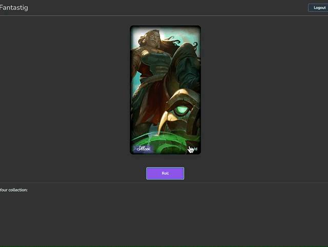

# FANTASTIG

## Character tracking app

### Project dependencies

[Nextjs](https://nextjs.org/)

[NextAuth](https://next-auth.js.org/)

[Typescript](https://www.typescriptlang.org/)

[Prisma](https://www.prisma.io/)

[Postgres](https://www.postgresql.org/)

[TailwindCSS](https://tailwindcss.com/)

[Twin.Macro](https://github.com/ben-rogerson/twin.macro)

[Styled Components](https://styled-components.com/)

#### How install project

- Install all dependencies first

```bash
yarn install
```

- Create database `fantastig` and create role `fantastig`. Make that this role has permission to create databases

- Migrate database to the latest schema

```bash
npx prisma migrate dev
```

- Seed data with initial information

```bash
npx prisma db seed --preview-feature
```

- Create `.env` file in the root of the project and add following information

```bash
NEXTAUTH_URL="http://localhost:3000"
DATABASE_URL="postgres://fantastig:@localhost:5432/fantastig?schema=public"
DISCORD_CLIENT_ID=YOUR_DISCORD_CLIENT_ID
DISCORD_CLIENT_SECRET=YOUR_DISCORD_CLIENT_SECRET
```

If you don't have discord application client id and secret follow [this link](https://discord.com/developers/applications) to sign up for developer access and create an app



